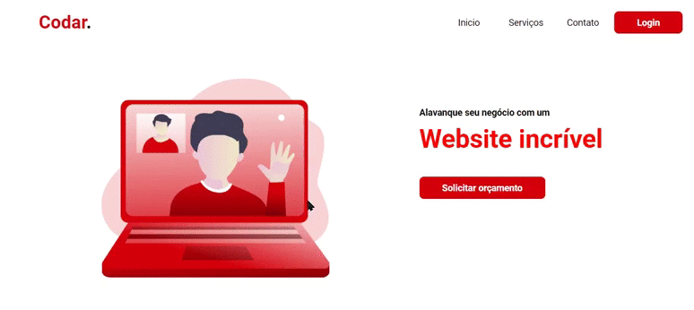

# Codar-devChallenge :rocket:
 Repositório responsável por armazenar o resultado do desafio do Dev Challenge do site codar.

## Dev Challenge :computer:

O Dev Challenge é um site onde é listado uma série de desafios para serem reproduzidos.

## Codar. :rocket:

O Codar. foi a tela escolhida.

## Tecnologias utilizadas :book:

* HTML
* CSS

## Como rodar :fire:

1. Clone este repositório
1. Abra no seu navegador o arquivo `index.html`.

###### Com amor :heart: Samuel
